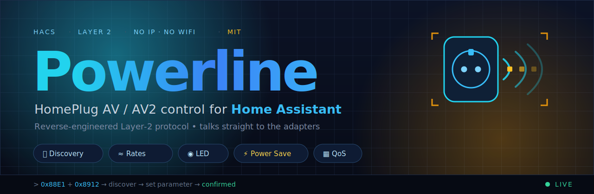

<div align="center">



# ⚡ Powerline for Home Assistant

**Monitor & control your HomePlug AV / AV2 powerline adapters — no IP, no WiFi, just Layer 2.**

Talks **directly** to pure PLC adapters over raw Ethernet (HomePlug AV `0x88E1` + Broadcom MEDIAXTREAM `0x8912`) — exactly like the official *tpPLC* app, but native in Home Assistant. Works with adapters that have **no IP address and no web UI**.

[](https://hacs.xyz/)
[](https://www.home-assistant.io/)
[](https://github.com/Chance-Konstruktion/ha-powerline/releases)
[](LICENSE)
[](PROTOCOL.md)

✅ **Verified end-to-end on TP-Link AV1000 (TL-PA7017, BCM60355) and AV500 (QCA7420)** — discovery, TX/RX rates, LED, power saving **and** QoS all confirmed on real hardware, including on **two** AV500 adapters.

> 🛡️ **PIB writes are safe by design.** AV500 LED / QoS / power-saving changes are applied with a *read-modify-write of the adapter's **own** PIB* — never a hard-coded image — carrying the same **universal open checksum** tpPLC uses (`~xorfold32` over the whole PIB). The frames are byte-identical to tpPLC and confirmed applying on two different adapters, and a rejected write is detected from the close status and reverted. Toggling these settings will **not brick** an adapter.

**[Quick Start](#-quick-start)** · **[Features](#-highlights)** · **[How it works](#-how-it-works)** · **[Protocol](PROTOCOL.md)** · **[Troubleshooting](#-troubleshooting)**

</div>

---

## 🤔 Why this exists

**Most powerline adapters have no IP, no app API, no web page — so how do you see them in Home Assistant?** You speak their native Layer-2 language. This integration does exactly that, straight over the Ethernet cable.

<table>
<tr>
<td width="33%" valign="top">

### 🔌 No IP needed
Pure PLC adapters (no WiFi, no web UI) are invisible to normal integrations. This one finds and reads them at **Layer 2**.

</td>
<td width="33%" valign="top">

### 🧪 Verified, not guessed
Every vendor command was **reverse-engineered from Wireshark** captures of the official tpPLC app and **tested on real AV1000 hardware** — LED, power saving and QoS all confirmed. See [`PROTOCOL.md`](PROTOCOL.md).

</td>
<td width="33%" valign="top">

### 🎯 Honest about chipsets
Feature support depends on the **chipset** (and on vendor firmware — AVM FRITZ!Powerline gets its [own module](PROTOCOL.md)), and the docs say so plainly — no fake "supported" checkmarks.

</td>
</tr>
</table>

---

## ✨ Highlights

<table>
<tr>
<td width="50%">🔎 <b>Auto-Discovery</b> — finds every adapter via Layer-2 broadcast</td>
<td width="50%">🟢 <b>Online status</b> — per-adapter connectivity binary sensor</td>
</tr>
<tr>
<td>📈 <b>TX/RX PHY rates</b> — real Mbit/s, shown on both link ends</td>
<td>💡 <b>LED control</b> — toggle the adapter LEDs (Broadcom + Qualcomm)</td>
</tr>
<tr>
<td>🔋 <b>Power saving</b> — standby mode on/off (Broadcom + Qualcomm)</td>
<td>🚦 <b>QoS priority</b> — Internet / Online Games / Audio-Video / VoIP</td>
</tr>
<tr>
<td>🧩 <b>Dual protocol</b> — auto-detects Broadcom vs Qualcomm</td>
<td>🛠️ <b>Diagnostic button</b> — full protocol scan to the log</td>
</tr>
</table>

> 💡 **Online status + rates work on every HomePlug AV/AV2 chipset.** LED, power saving and QoS work on **both Broadcom** (MEDIAXTREAM `Set Parameter`) **and Qualcomm** (AV500-class, via a safe PIB read-modify-write) — verified on real hardware. See the [feature matrix](#-supported-hardware).

---

## 🧭 How it works

```
Home Assistant  (Ethernet · CAP_NET_RAW)
      │  raw Layer-2 frames
      ├── 0x88E1  HomePlug AV  → CC_DISCOVER_LIST   (all chipsets)
      └── 0x8912  MEDIAXTREAM  → rates · LED · QoS  (Broadcom)
      │
   ┌──┴───────── power line ─────────────┐
 Adapter A  ◀───  PHY link (Mbit/s)  ───▶  Adapter B
```

No router, no cloud, no IP — the integration opens raw `AF_PACKET` sockets and
exchanges HomePlug management messages directly with the adapters. Full wire
details live in **[`PROTOCOL.md`](PROTOCOL.md)**.

---

## 🚀 Quick Start

**1. Install via HACS** (Custom repository → Integration)

```text
HACS → ⋮ → Custom repositories
Repository: Chance-Konstruktion/ha-powerline
Category:   Integration
```

**2. Restart Home Assistant**, then add the integration:

```text
Settings → Devices & Services → Add Integration → "Powerline"
```

**3. Click *Submit*** — adapters are discovered automatically. Done.

> ⚠️ **Requires `CAP_NET_RAW` + a wired Ethernet path to a powerline adapter.**
> WiFi cannot send Layer-2 HomePlug frames. See [Requirements](#-requirements).

---

## 🧰 Supported Hardware

| Adapter / Chipset | Status & rates | LED | Power Save · QoS |
|---|:---:|:---:|:---:|
| TP-Link **AV1000** / TL-PA7017 — Broadcom BCM60355 | ✅ **verified** | ✅ **verified** | ✅ **verified** |
| Other **Broadcom** (MEDIAXTREAM) adapters | ✅ | ✅ *(expected)* | ✅ *(expected)* |
| Qualcomm **QCA7420** (AV500-class) | ✅ **verified** | ✅ **verified** *(via PIB)* | ✅ **verified** *(via PIB)* |
| **FRITZ!Powerline** (AVM QCA7420, e.g. 510E) | ✅ | ✅ *(see note)* | — *(not on device)* |
| devolo dLAN · misc HomePlug AV/AV2 | ✅ | depends on chipset | depends on chipset |

> ✅ = tested & confirmed on real hardware. Verified end-to-end — discovery,
> TX/RX rates, LED, power saving and QoS — on the **AV1000 (TL-PA7017)**
> (Broadcom, since 0.1) and on **two AV500 / QCA7420** adapters (Qualcomm, 0.2).

> 🟦 **FRITZ!Powerline (AVM):** these adapters use a QCA7420 chip but ship AVM's
> own "Custom" firmware, so they get a **dedicated module** (`homeplug/fritz.py`).
> Discovery, online status and PHY rates work like any QCA adapter. **LED on/off**
> is implemented via AVM's larger PIB (9796 B) and AVM-specific LED offsets — it
> was reconstructed **byte-for-byte from a capture of the FRITZ!Powerline app**
> (the generic QCA path failed only because of the wrong PIB size/offsets).
> **QoS and power saving are not offered** because the device itself has no such
> setting (the FRITZ!Powerline app only exposes LED, restart and reset). A
> **Restart** button is provided (soft reboot via `VS_RS_DEV`); factory reset is
> not implemented yet. See [`PROTOCOL.md` §9b](PROTOCOL.md).

> ℹ️ On **Qualcomm** adapters, LED/QoS/power-saving live inside the device's
> *Parameter Information Block*. We change them exactly the way the vendor app
> does — a **read-modify-write of the adapter's own PIB** carrying the universal
> open checksum — verified byte-identical to tpPLC on two adapters, so it applies
> safely (a rejected write is detected and reverted, never half-applied). Details
> in [`PROTOCOL.md` §9](PROTOCOL.md#9--qualcomm-qca--av500--implemented--verified).

<details>
<summary><b>📋 Entities created</b></summary>

### Network overview (virtual device)
| Entity | Type | Description |
|--------|------|-------------|
| Adapters Online | Sensor | Reachable adapters (`total` ever-seen as attribute) |
| Slowest Link | Sensor | Weakest link rate in the network (Mbit/s) — the actual bottleneck |
| Network Problem | Binary Sensor (`problem`) | On when a known adapter is offline |
| Diagnose | Button | Runs a full protocol scan to the log |
| All LEDs On / Off | Button | Turns every adapter's LED on or off at once (like tpPLC) |

### Per adapter
| Entity | Type | Default |
|--------|------|---------|
| TX Rate / RX Rate | Sensor | Enabled |
| Status | Binary Sensor (`connectivity`) | Enabled |
| LED | Switch | Disabled |
| Power Saving | Switch | Disabled |
| QoS Priority | Select | Disabled |
| Restart | Button (`restart`) | FRITZ!Powerline only |

**What the controls do** (mirrors the tpPLC app):
- **LED** — turn the adapter's LEDs on or off.
- **Power Saving** — reduces the adapter's power consumption when the connected
  device has been switched off or unplugged for ~5 minutes.
- **QoS Priority** — choose the traffic type to give the highest priority:
  **Internet**, **Online Games**, **Audio / Video**, or **Voice over IP**.

LED / Power Saving / QoS are disabled by default — enable them per entity. They
work on both Broadcom and Qualcomm (AV500) adapters. On **FRITZ!Powerline (AVM)**
only the **LED** switch is created — those devices have no QoS or power-saving
setting, so those entities are deliberately omitted.
</details>

<details>
<summary><b>⚙️ Configuration</b></summary>

**Settings → Devices & Services → Powerline → Configure**

| Option | Default | Range | Description |
|--------|---------|-------|-------------|
| Scan interval | 120 s | 10–600 s | Discovery + rate polling interval |

**Removing a single adapter.** Each adapter is its own device, so you don't have
to delete and re-add the whole integration to get rid of one. Open the adapter's
device page (**Settings → Devices & Services → Powerline → the adapter**) and use
the **Delete** button in the device menu. This is handy for an adapter that was
wrongly detected, or one you've swapped out / replaced — the old entry and all
its entities are removed, and it won't come back after a restart. The
**Powerline Network** overview device can't be deleted (it represents the
integration itself). Note: an adapter that is *still plugged in and reachable*
will be rediscovered on the next poll — unplug it first, then delete it.
</details>

---

## 📦 Requirements

**Raw socket access (`CAP_NET_RAW`)** + a **wired Ethernet** path to an adapter.

<details>
<summary><b>Docker</b></summary>

```yaml
services:
  homeassistant:
    cap_add:
      - NET_RAW
    network_mode: host
```
</details>

<details>
<summary><b>HAOS</b></summary>

Works out of the box (host networking is the default).
</details>

<details>
<summary><b>Python venv</b></summary>

```bash
sudo setcap cap_net_raw+ep $(readlink -f $(which python3))
```
</details>

---

## 🩺 Troubleshooting

Enable debug logging first:

```yaml
logger:
  logs:
    custom_components.powerline: debug
```

<details>
<summary>"Raw socket access not available"</summary>

Add the `CAP_NET_RAW` capability — see [Requirements](#-requirements).
</details>

<details>
<summary>"No Powerline adapters found"</summary>

Check the **Ethernet cable** (WiFi can't carry HomePlug frames) and that the
adapters are plugged in and paired.
</details>

<details>
<summary>LED / Power Saving / QoS do nothing</summary>

These work on both **Broadcom** (MEDIAXTREAM) and **Qualcomm** (QCA, via the PIB)
adapters — verified on AV1000 and AV500. If a toggle has no effect: make sure the
adapter is **online** (an offline adapter shows its controls as *unavailable*),
and note that other/older chipsets or firmware may not expose these controls.
On **FRITZ!Powerline (AVM)** only **LED** is available (the device has no QoS or
power-saving setting); restart/reset are not implemented yet.
See the [feature matrix](#-supported-hardware).
</details>

<details>
<summary>Deep protocol analysis (Wireshark)</summary>

```text
eth.type == 0x88e1 || eth.type == 0x8912
```

Capture the official tpPLC app performing an action and compare with
[`PROTOCOL.md`](PROTOCOL.md).
</details>

---

## 🗺️ Roadmap

- [x] **0.1 — Broadcom / AV1000 (verified):** discovery, TX/RX rates, LED, power saving, QoS — all confirmed on TL-PA7017.
- [x] **0.2 — Qualcomm / AV500 (verified):** LED, QoS and power saving via the PIB, with the universal open checksum (`~xorfold32` of the whole PIB) so config writes apply on every adapter — confirmed applying on **two** AV500s, no reset needed ([details](PROTOCOL.md#9--qualcomm-qca--av500--implemented--verified)).
- [x] **FRITZ!Powerline (AVM):** dedicated `homeplug/fritz.py` module — discovery/rates, **LED on/off** (reconstructed byte-for-byte from the FRITZ!Powerline app) and a **Restart** button (`VS_RS_DEV` 0xA01C). QoS/power-saving are intentionally omitted (the device has no such setting).
- [ ] **FRITZ!Powerline factory reset:** a separate one-shot AVM MME — pending a capture of the reset action from the FRITZ!Powerline app.
- [ ] **rates between two same-chipset adapters:** `NW_STATS` reports the rate against the *peer*, so a link is mirrored onto the responder. Two AV500s (or any pair where neither answers `NW_STATS`) can still show no rate.
- [ ] **G.hn powerline** *(maybe someday)* — G.hn (ITU-T G.9960/61, e.g. devolo Magic) is a **separate, incompatible** standard and would need its own module. On the wishlist for if/when suitable adapter hardware is available to capture and test.

---

## 🤝 Contributing

PRs welcome — especially Wireshark captures from new adapters. Validate with:

```bash
python -m compileall custom_components/powerline
python -m pytest tests/
```

See [`CONTRIBUTING.md`](CONTRIBUTING.md) and the wire-level reference in [`PROTOCOL.md`](PROTOCOL.md).

## 📄 License

[MIT](LICENSE) — © 2026 Chance-Konstruktion

## 🙏 Acknowledgments

- [`serock/mediaxtream-dissector`](https://github.com/serock/mediaxtream-dissector) · [`serock/pla-util`](https://github.com/serock/pla-util) · [`jbit/powerline`](https://github.com/jbit/powerline) · [`qca/open-plc-utils`](https://github.com/qca/open-plc-utils)
- [peanball.net powerline monitoring guide](https://peanball.net/2023/08/powerline-monitoring/)

<div align="center">
<sub>Built for pure-PLC adapters that nobody else talks to · ⚡ Layer 2 all the way down</sub>
</div>
